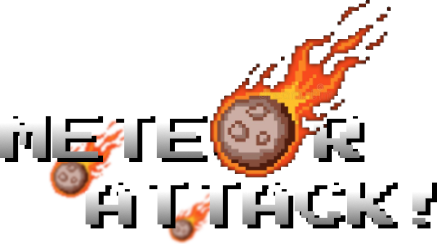
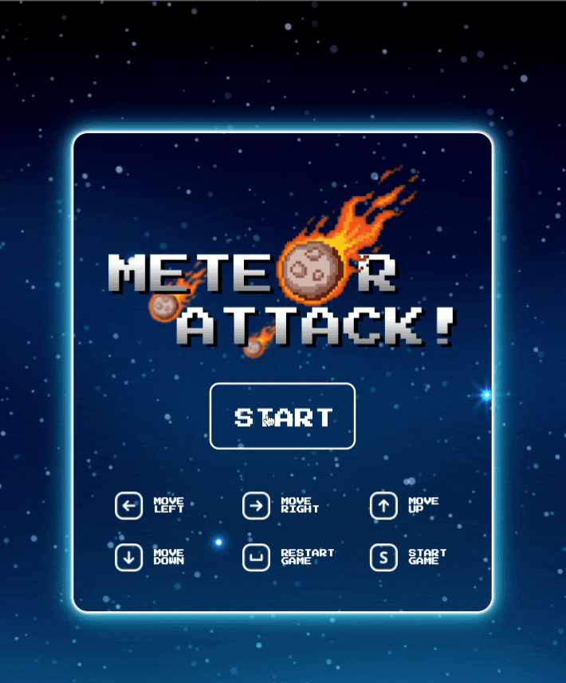
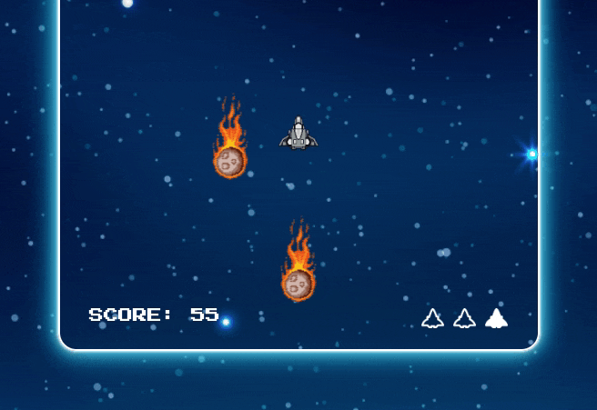
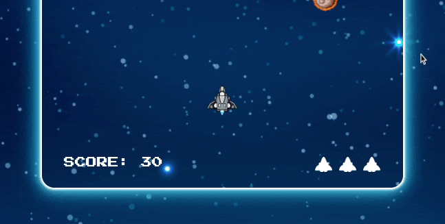
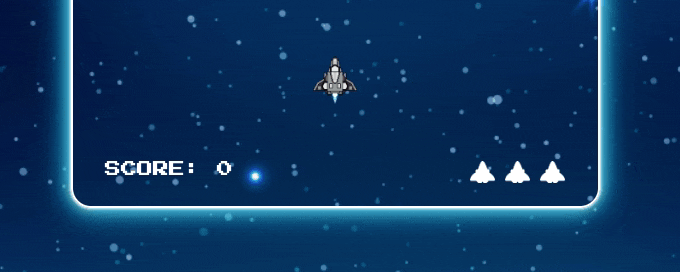

# Object Oriented Programming Game Project

## Welcome to Meteor Attack! v1.0. Are you the good pilot who can save us from meteors? If you think so, let's give it a try and see what you can do! More dodged meteors, more scores! Dont forget, you have only three shots!

## **Live demo : https://meteor-attack.netlify.app**

## **Details**

1. When you click to start button or press "S" the game starts.

> _HINT:_ In order to increase the playability, only the meteors itself can explode you ship, not the flames behind it. It can give you the ability dodging meteors more easily.

2. Use arrow keys to move your ship

> _HINT:_ Dont forget to press the keys for every move you want to make.

3. As you lost your ship it explodes, a new ship instantly comes from the bottom

> _HINT:_ The new ship borns and moves to the last position of your previous ship. So, be ready!

4. You can see your score and how many lives left at the bottom of the game

---

## **Ideas that I would like to implement if I had more time**

1. Making the ship can shoot the meteors
2. Randomly falling extra lives
3. Randomly falling shields that can protect the ship from collision for certain time (maybe 15sec)
4. A shield for first 3 or 4 seconds for letting the user adapting to the game
5. Level system that increase the amount and speed of the meteors
6. Making the whole game horizantal, moving forward to right

## Credits

- Meteor image: https://www.dreamstime.com/falling-fiery-pixel-meteor-flaming-asteroid-rushing-towards-planet-burning-fire-glowing-meteorite-core-red-flame-image221021263
- Ship image: https://celestiall.carrd.co/
